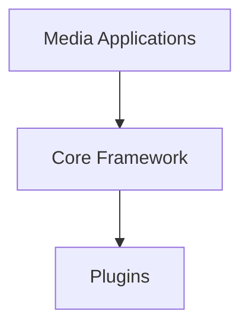
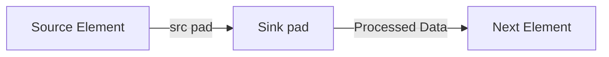
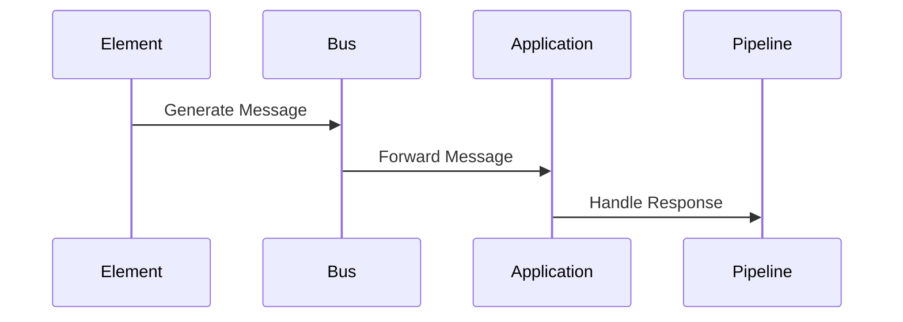

# GStreamer Framework: Architecture and Development Guide


## Overview
GStreamer is a cross-platform multimedia framework supporting Windows, Linux, Android, and iOS. It enables developers to construct processing pipelines through interconnected elements, providing flexible multimedia handling capabilities with support for dynamic pipeline reconfiguration.

## Framework Architecture

### 1. Layer Structure


#### Media Applications
- Built-in tools (`gst-launch`, `gst-inspect`)
- High-level libraries (`gst-player`, `gst-rtsp-server`)
- Custom applications using GStreamer APIs
- Production deployments using GStreamer daemon (gstd)

#### Core Framework
- Plugin management system
- Pipeline orchestration
- Inter-element communication
- Media synchronization
- Utility libraries

#### Plugins
| Category    | Description                          | Examples                  |
|-------------|--------------------------------------|--------------------------|
| Protocols   | Network/IO protocols                 | file, http, rtsp         |
| Sources     | Data acquisition                     | alsa, v4l2, tcp/udp      |
| Formats     | Container formats                    | avi, mp4, ogg            |
| Codecs      | Encoding/decoding                    | h264, vorbis, mp3        |
| Filters     | Stream processing                    | converters, effects      |
| Sinks       | Output destinations                  | xvimagesink, alsasink    |

### 2. Plugin Classification
| Package             | Description                                  |
|---------------------|----------------------------------------------|
| gstreamer           | Core framework & essential elements         |
| gst-plugins-base    | LGPL-licensed basic plugins                  |
| gst-plugins-good    | High-quality LGPL plugins                    |
| gst-plugins-ugly    | Patent-encumbered components (e.g., H.264, MPEG-2) |
| gst-plugins-bad     | Experimental/under development               |
| gst-libav           | Libav integration                            |

## Core Concepts

### 1. Elements
Basic processing units with specific functions:
- **Source Elements**: Data producers (e.g., filesrc)
- **Filter Elements**: Data processors (e.g., videoconvert)
- **Sink Elements**: Data consumers (e.g., autovideosink)
- **Demuxers/Muxers**: Stream separation/combination (e.g., oggdemux, mp4mux)

### 2. Pads


- **Capabilities Negotiation**:
```bash
gst-launch-1.0 videotestsrc ! "video/x-raw,width=1280,height=720" ! autovideosink
```

### 3. Bins & Pipelines
- **Bin**: Container for multiple elements
- **Pipeline**: Top-level bin with synchronization control

**Example Playback Pipeline**:
```bash
gst-launch-1.0 filesrc location=file.ogv ! oggdemux name=demux \
! queue ! vorbisdec ! autoaudiosink demux. ! queue ! theoradec ! videoconvert ! autovideosink
```

## Data Flow Management

### 1. Communication Mechanisms
| Type       | Description                                  |
|------------|----------------------------------------------|
| Bus        | Thread-safe application messaging            |
| Buffers    | Raw media data containers                    |
| Events     | Control commands (e.g., seek)                |
| Queries    | Pipeline state interrogation                 |

### 2. Message Flow


## Plugin Development

### 1. Template Setup
```bash
git clone https://gitlab.freedesktop.org/gstreamer/gst-template.git
cd gst-template/gst-plugin/src
../tools/make_element MyFilter
```

### 2. Basic Plugin Structure
**Header File (`gstmyfilter.h`)**:
```c
#include <gst/gst.h>

typedef struct _GstMyFilter {
  GstElement element;
  GstPad *sinkpad, *srcpad;
  gboolean silent;
} GstMyFilter;

G_DECLARE_FINAL_TYPE(GstMyFilter, gst_my_filter, GST, MY_FILTER, GstElement)
```

**Implementation File (`gstmyfilter.c`)**:
```c
#include "gstmyfilter.h"

G_DEFINE_TYPE(GstMyFilter, gst_my_filter, GST_TYPE_ELEMENT);

static void gst_my_filter_class_init(GstMyFilterClass *klass) {
  GstElementClass *element_class = GST_ELEMENT_CLASS(klass);
  
  gst_element_class_set_static_metadata(element_class,
    "My Filter", "Filter/My", "Custom filter example", "Developer <dev@example.com>");
}

static void gst_my_filter_init(GstMyFilter *filter) {
  // Initialize pads and properties
}

GST_PLUGIN_DEFINE(
  GST_VERSION_MAJOR,
  GST_VERSION_MINOR,
  my_filter,
  "My custom filter plugin",
  my_filter_init,
  "1.0",
  "LGPL",
  "gst-plugin",
  "https://example.com"
)
```

### 3. Pad Templates
```c
static GstStaticPadTemplate sink_factory =
GST_STATIC_PAD_TEMPLATE("sink", GST_PAD_SINK, GST_PAD_ALWAYS,
  GST_STATIC_CAPS("audio/x-raw, format=S16LE, channels=2, rate=44100"));

static GstStaticPadTemplate src_factory =
GST_STATIC_PAD_TEMPLATE("src", GST_PAD_SRC, GST_PAD_ALWAYS,
  GST_STATIC_CAPS("audio/x-raw, format=S16LE, channels=2, rate=44100"));
```

### 4. Build Configuration
**meson.build**:
```meson
project('gst-my-filter', 'c', version: '1.0.0')

gst_dep = dependency('gstreamer-1.0')

shared_library('gstmyfilter',
  'gstmyfilter.c',
  dependencies: [gst_dep],
  install_dir: get_option('libdir') / 'gstreamer-1.0',
  install: true)
```

## Tools & Examples

### 1. Inspection Tool
```bash
gst-inspect-1.0 playbin
```

### 2. Pipeline Construction
**Streaming Example**:
```bash
# Server
gst-launch-1.0 videotestsrc ! x264enc ! rtph264pay ! udpsink host=127.0.0.1 port=1234

# Client
gst-launch-1.0 udpsrc port=1234 ! rtph264depay ! decodebin ! autovideosink
```

**Transcoding Example**:
```bash
gst-launch-1.0 filesrc location=input.mp4 ! decodebin \
! videoscale ! video/x-raw,width=640 ! x264enc ! mp4mux ! filesink location=output.mp4
```

## References
- [Official Documentation](https://gstreamer.freedesktop.org/documentation/)
- [Plugin Development Guide](https://gstreamer.freedesktop.org/documentation/plugin-development/)
- [GStreamer Daemon (gstd)](https://developer.ridgerun.com/wiki/index.php/GStreamer_Daemon)
- [Element Registration Patterns](https://gstreamer.freedesktop.org/documentation/plugin-development/basics/index.html?gi-language=c)
